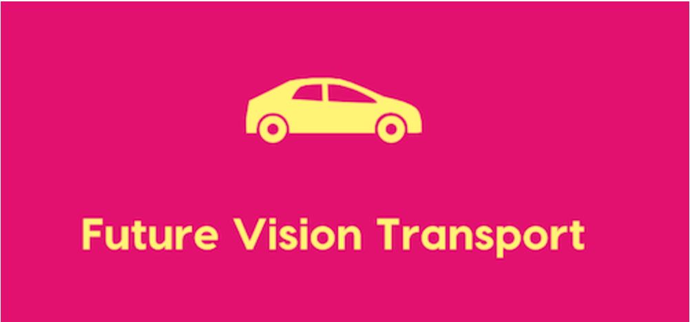

# Participez à la conception d'une voiture autonome

**Projet n° 8** du parcours [Ingénieur IA](https://openclassrooms.com/fr/paths/188-ingenieur-ia) chez [Openclassrooms](https://openclassrooms.com/fr/)

## Description
Future Vision Transport est une entreprise qui conçoit des systèmes embarqués de vision par ordinateur pour les véhicules autonomes.
Vous êtes l’un des ingénieurs IA au sein de l’équipe R&D de cette entreprise. Votre équipe est composée d’ingénieurs aux profils variés. Chacun des membres de l’équipe est spécialisé sur une des parties du système embarqué de vision par ordinateur. 

Voici les différentes parties du système :
 - acquisition des images en temps réel
 - traitement des images
 - segmentation des images (c’est vous !)
 - système de décision

## Objectifs
 - entraîner et déployer un modèle de segmentation des images sur les 8 catégories principales en utilisant Azure Machine Learning. Keras est le framework de travail commun à toute l’équipe. Attention aux contraintes de Franck !
 - déployer une API Flask grâce au service Azure qui sera utilisée par Laura.

## Compètences
 - Evaluer la performance d’un modèle de Deep Learning sur des images
 - Manipuler un jeu de données volumineux
 - Utiliser des techniques d’augmentation des données
 - Entraîner un modèle de Deep Learning sur des images
